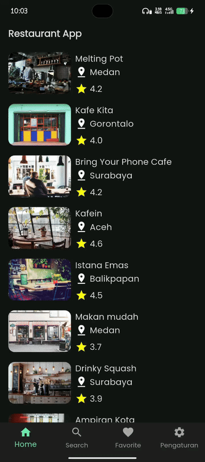

# Hi there 👋

I'm Ibnu Malik Mudzopar, S.T. 
 _Flutter developer focused on building clean and maintainable mobile applications._

### 🚀 About Me
- 📱 Building apps using **Flutter & Dart**
- 🧠 Interested in **clean architecture** and scalable systems
- 🌱 Currently learning advanced state management and testing
- 📍 Based in Indonesia 🇮🇩

### 🛠 Tech Stack

  
## ⭐ Featured Project — Restaurant App
_A Flutter application showcasing API integration, local database, daily notifications, and clean architecture principles._
### 🎬 Preview

### ✨ Features
- Fetch data from API
- Detail page with smooth navigation
- Search restaurants in realtime
- Add/remove favorites (local database)
- Error handling
- Loading state
- Daily reminder notification at 11 AM
### 🧠 What I Practiced
- Clean architecture (separation of concerns)
- State management with Provider
- API handling and error states
- Local persistence using SQLite
- Background task & notifications
- Writing maintainable UI
- ### 🧠 Engineering Thinking
- Designed UI to handle loading, success, and error states
- Structured features to be modular and maintainable
- Focused on clear separation between UI and logic

### 🛠 Tech Stack
Flutter & Dart • REST API • SQLite • Provider • Firebase Hosting • Workmanager
### ▶️ Code

### ⚙️ Notes
- Public API used — no authentication required
- Focused on readability and maintainability

  
## 📜 Certifications
_Focused on mobile development learning path._

- 🏅 Belajar Fundamental Aplikasi Flutter — Dicoding (2026)  
  🔗 https://www.dicoding.com/certificates/ERZRL5L42ZYV  
  🧠 Learned: state management, API integration, local storage, notification, testing

- 🏅 Belajar Membuat Aplikasi Flutter untuk Pemula — Dicoding (2025)  
  🔗 https://www.dicoding.com/certificates/JLX15V085Z72  
  🧠 Learned: Flutter basics, widget system, navigation, deployment

- 🏅 Memulai Pemrograman dengan Dart — Dicoding (2025)  
  🔗 https://www.dicoding.com/certificates/QLZ9639G7Z5D  
  🧠 Learned: OOP, async programming, collections, language fundamentals

- 🏅 Memulai Pemrograman dengan Kotlin — Dicoding (2023)  
  🔗 https://www.dicoding.com/certificates/81P279J9OZOY

- 🏅 Belajar Membuat Aplikasi Android untuk Pemula — Dicoding (2023)  
  🔗 https://www.dicoding.com/certificates/07Z6WG5OMZQR

_While my main focus is mobile development, I’ve explored AI and data topics out of curiosity to broaden my understanding of software systems._
#### 🌱 Additional Learning (Cross-discipline Interests)
_I’m also curious about broader areas in software and data to expand my perspective._

- 🏅 Memulai Pemrograman dengan Python — Dicoding (2023)  
  🔗 https://www.dicoding.com/certificates/EYX400OEWPDL

- 🏅 Belajar Dasar AI — Dicoding (2025)  
  🔗 https://www.dicoding.com/certificates/GRX5J3K9YX0M

- 🏅 Belajar Machine Learning untuk Pemula — Dicoding (2024)  
  🔗 https://www.dicoding.com/certificates/EYX40V9KRPDL

- 🏅 Belajar Dasar Visualisasi Data — Dicoding (2023)  
  🔗 https://www.dicoding.com/certificates/QLZ944NLEP5D

## 📫 Contact, Feel free to reach out

 
 
 
 
##
### 📊 My Statistics

<!--
**wilbur-sys/wilbur-sys** is a ✨ _special_ ✨ repository because its `README.md` (this file) appears on your GitHub profile.

Here are some ideas to get you started:

- 🔭 I’m currently working on ...
- 🌱 I’m currently learning ...
- 👯 I’m looking to collaborate on ...
- 🤔 I’m looking for help with ...
- 💬 Ask me about ...
- 📫 How to reach me: ...
- 😄 Pronouns: ...
- ⚡ Fun fact: ...
-->
